<!-- 1.what are features of python  -->

<!-- 2.what are the keywords in python -->

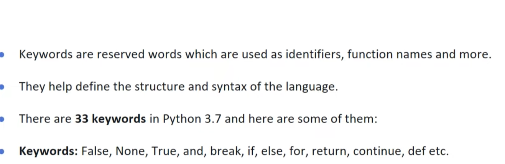

<!-- 3.what is literals in python? -->

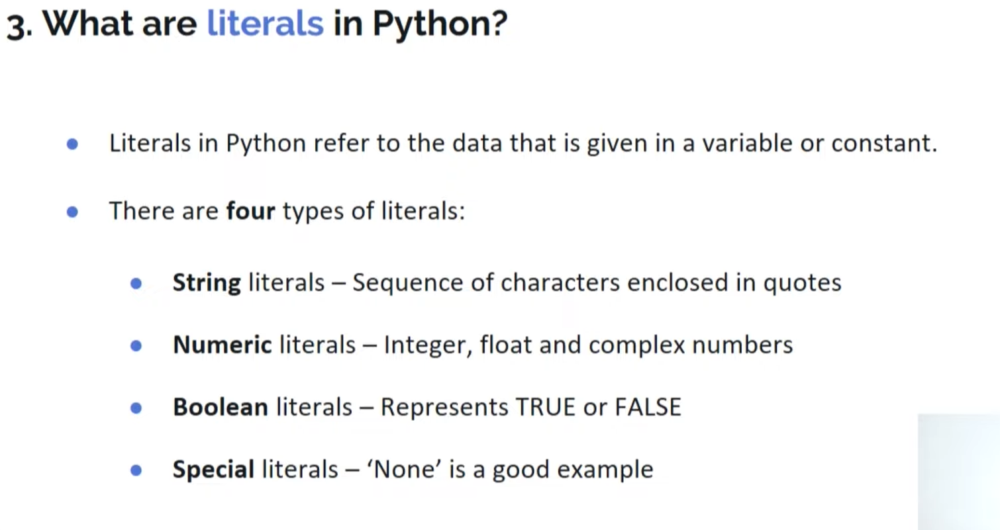

<!-- 4.how can we concatenate two tuples? -->

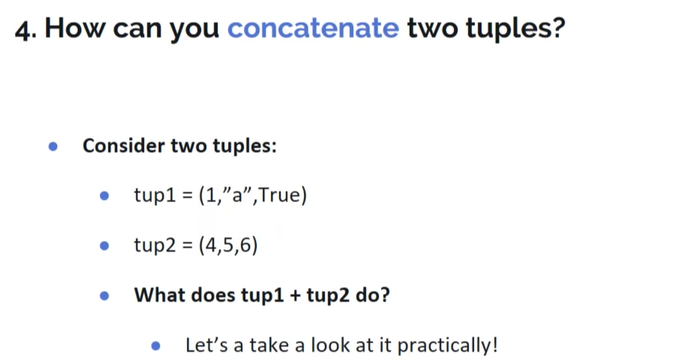
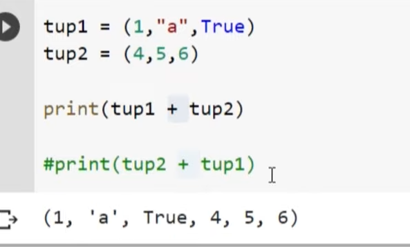

<!-- 5.what are functions in python? -->

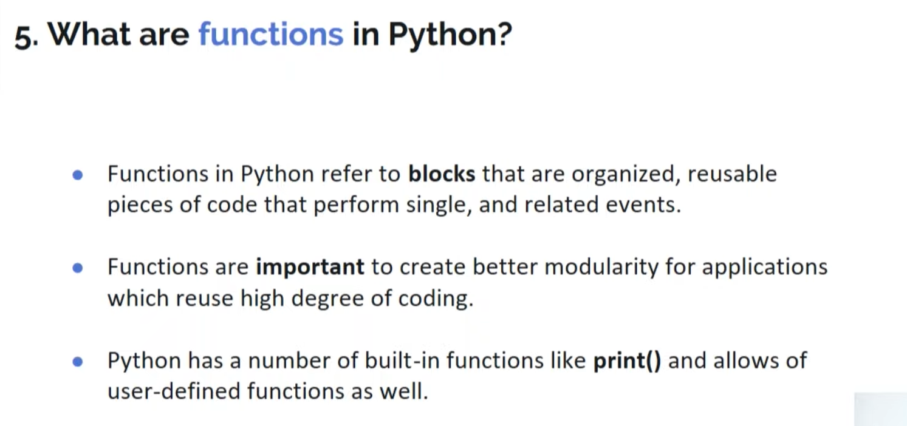

<!-- 6.how can you initialize a 5*5 NumPy array with only zeros? -->

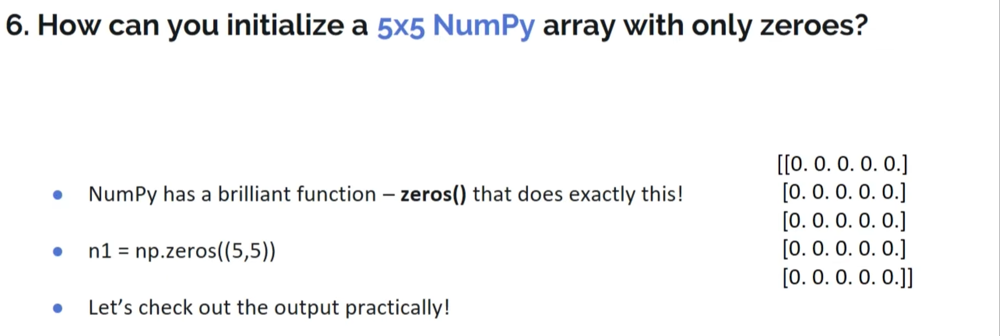
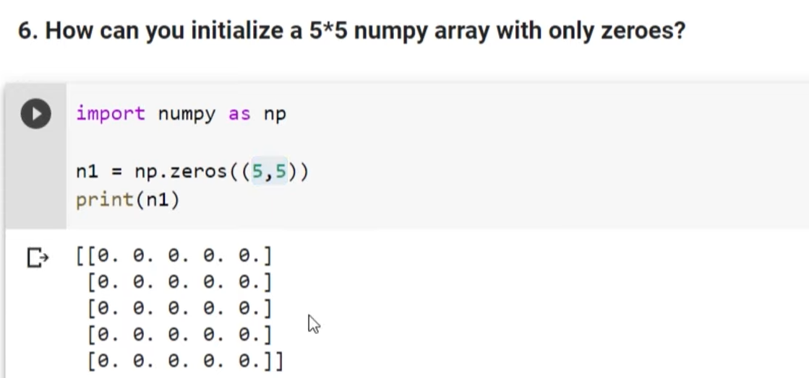

<!-- 7.what is pandas? -->

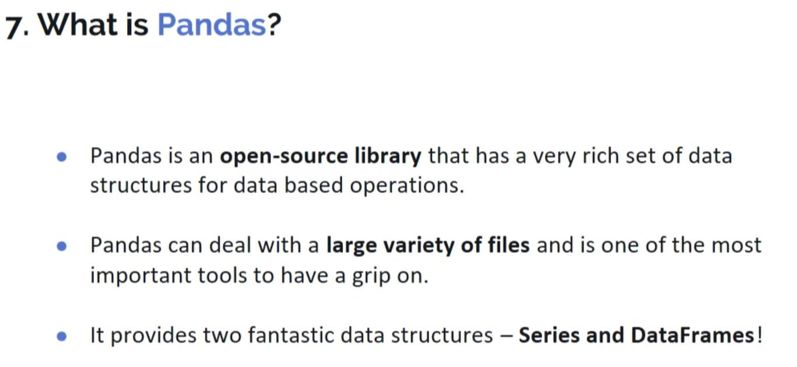

<!-- 8.what are dataframes ? -->

<!-- 9.what is series in pandas? -->

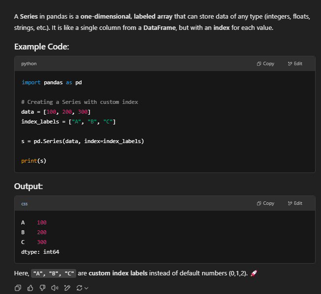

<!-- 10.what is the use of pandas groupby() function? -->

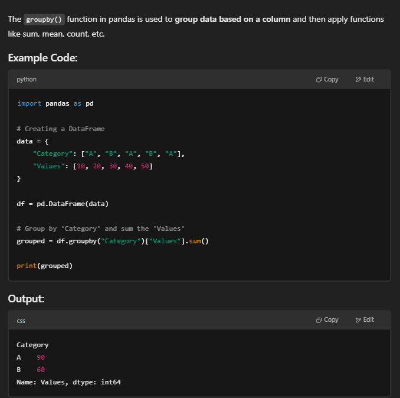

<!-- 11.how to create a dataframe from lists? -->

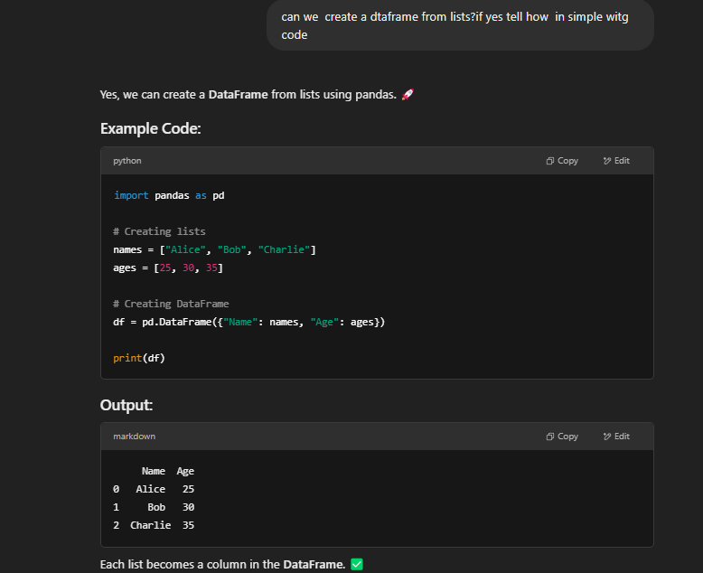

<!-- 12.how to create a dataframe from dictionary? -->

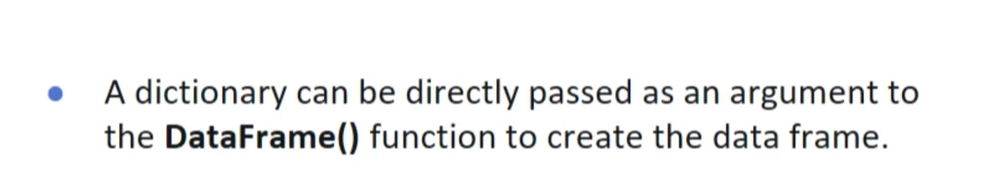
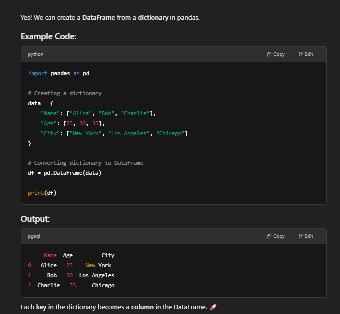

<!-- 13.how to combine dataframes using join() function? -->

The join() function in Pandas is used to merge two DataFrames based on their common index or column.

Key Points:
It helps extract data from multiple DataFrames that share common columns.

It combines the data in a side-by-side (horizontal) manner.
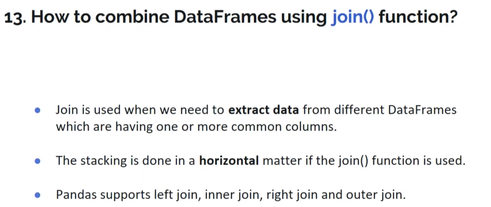

<!-- 14.which method works best for vertical stacking of dataframes? -->

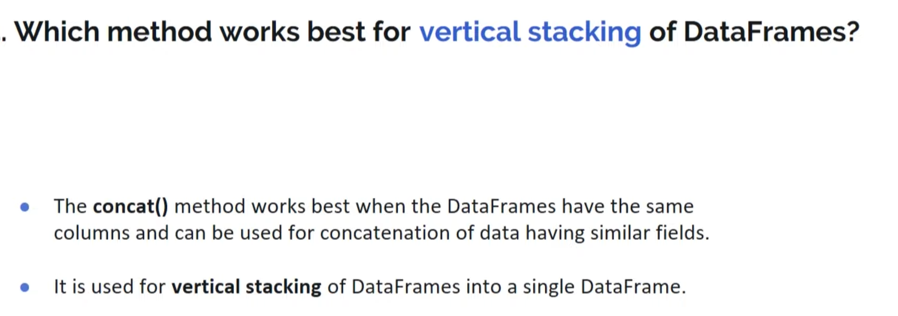
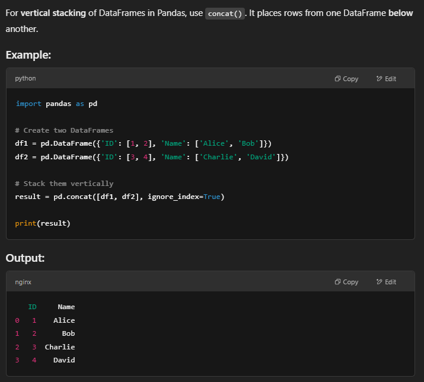

<!-- 15.how to merge dataframes in pandas? -->